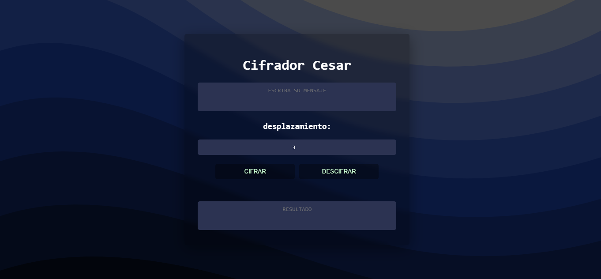

# Cifrador Cesar

### Caesar-cipher  
visitar: [cifrador cesar](https://eliseodesign.github.io/cifrador-cesar/)

## Descripción

---

Cifrador y desifrador de mensajes cesar. es un tipo de substitución que funciona con letras desplazandolas una cierta cantidad de posiciones

## Description

---

Cesar Encryption and Decryption of Messages. It is a type of substitution encryption in which a letter in the original text is replaced by another letter.
